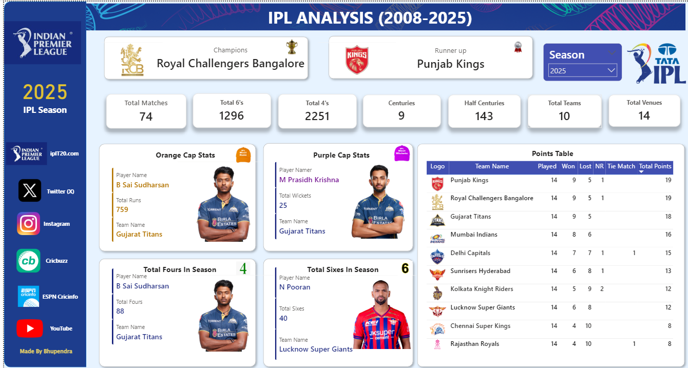

# 🏏 IPL Analysis Dashboard (2008–2025)

## 📌 Project Overview

The **IPL Analysis Dashboard** is an interactive Power BI project designed to analyze Indian Premier League (IPL) data from **2008 to 2025**.

This dashboard provides deep cricket insights through dynamic visualizations, KPI tracking, and season-wise analysis. It helps users explore IPL history, team performance, player statistics, and match trends in an engaging and data-driven way.

---

# 🎯 Project Objectives

* Analyze IPL matches and seasonal trends
* Compare team performances across different years
* Identify top-performing batsmen and bowlers
* Analyze boundary statistics (4s & 6s)
* Track Orange Cap and Purple Cap winners
* Create interactive KPIs and visual insights

---

# 🛠️ Tools & Technologies Used

* **Power BI**
* **Power Query**
* **DAX**
* **CSV Files**

---

# 📂 Dataset Information

The project uses the following datasets:

| File Name                 | Description                    |
| ------------------------- | ------------------------------ |
| `BALL_BY_BALL_DATA.csv`   | Ball-by-ball IPL match data    |
| `PLAYER_DATA_UPDATED.csv` | Player details and information |
| `PLAY_MATCHES_DATA.csv`   | Match-level IPL data           |
| `TEAM_DATA.csv`           | Team and franchise details     |

---

# 📊 KPI Metrics Included

The dashboard includes the following KPIs:

* ✅ Total Matches
* ✅ Total 4s
* ✅ Total 6s
* ✅ Total Centuries
* ✅ Total Half-Centuries
* ✅ Total Teams
* ✅ Total Venues
* ✅ Orange Cap Winners
* ✅ Purple Cap Winners
* ✅ Total Fours in Each Season
* ✅ Total Sixes in Each Season
* ✅ Season-wise Points Table
* ✅ Winning Team by Season
* ✅ Runner-Up Team by Season

---

# 📈 Dashboard Features

## 🔹 Team Analysis

* Team-wise total wins
* Win percentage comparison
* Most successful IPL franchises
* Season performance trends

## 🔹 Batting Analysis

* Most runs scored
* Total boundaries (4s & 6s)
* Century and half-century analysis
* Orange Cap winners

## 🔹 Bowling Analysis

* Most wickets
* Purple Cap winners
* Bowling performance insights

## 🔹 Match Analysis

* Highest-scoring matches
* Boundary trends
* Season-wise match statistics

## 🔹 Season Insights

* IPL champions by season
* Runner-up teams
* Season-wise points table
* Total fours and sixes in each season

---

# 🔄 Project Workflow

1. Data Collection
2. Data Cleaning using Power Query
3. Data Modeling
4. DAX Measures & KPI Creation
5. Dashboard Design
6. Data Visualization & Insights

---

# 💡 Key Insights Generated

* Certain teams dominated specific IPL eras
* Boundary counts increased significantly over the years
* Top-order batsmen contributed the majority of runs
* Consistent franchises performed better across seasons
* Batting performances heavily influenced match outcomes

---

# 📸 Dashboard Preview
<p align="center">
  
</p>


---

# 📁 Project Structure

```bash
IPL-Analysis-2008-2025/
│
├── Dataset/
│   ├── BALL_BY_BALL_DATA.csv
│   ├── PLAYER_DATA_UPDATED.csv
│   ├── PLAY_MATCHES_DATA.csv
│   └── TEAM_DATA.csv
│
├── Images/
│   ├── Dashboard_image.png
│   ├── IPL_logo.png
│   ├── Team_logos/
│   ├── Player_images/
│   └── Icons/
│
├── PowerBI_File/
│   └── IPL_ANALYSIS.pbix
│
└── README.md
```

---

# 👨‍💻 Author

## Bhupendra Sethiya

* Aspiring Data Analyst
* Skilled in Power BI, SQL, Excel, and Data Visualization

---
